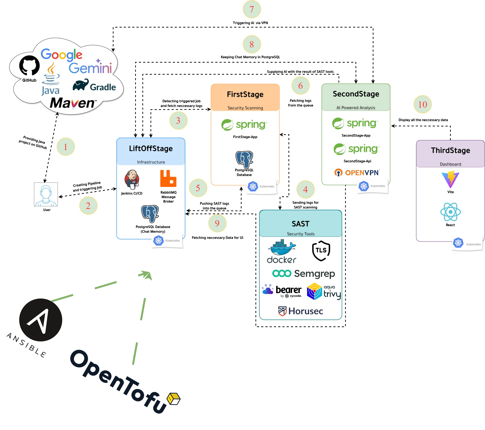
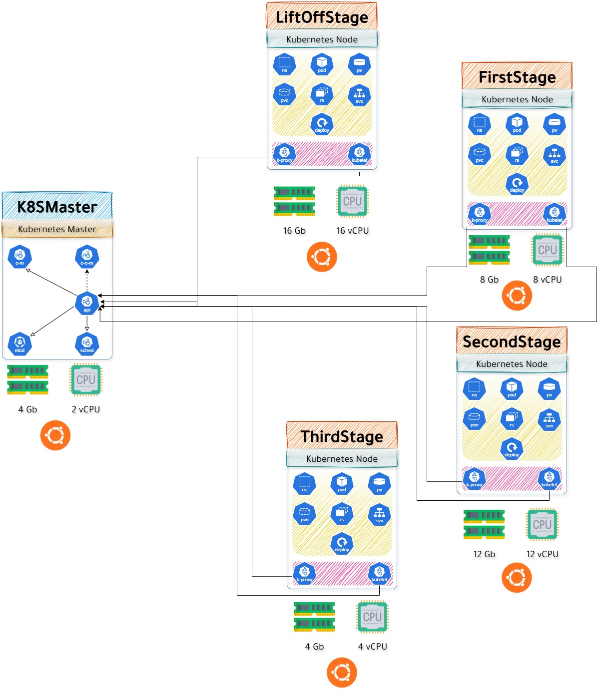

# DevSecOps AI Platform

A comprehensive, enterprise-grade DevSecOps platform that integrates AI-powered security analysis, automated CI/CD monitoring, and intelligent anomaly detection across the entire software development lifecycle.


## 🎯 **Platform Overview**

The DevSecOps AI Platform is a multi-stage, cloud-native solution that provides:

- **🔒 Automated Security Analysis**: Real-time secret detection, SAST scanning, and vulnerability assessment
- **🤖 AI-Powered Monitoring**: Google Gemini AI integration for intelligent anomaly detection and conversation-based analysis
- **📊 Comprehensive Dashboard**: React-based real-time visualization with interactive charts and monitoring
- **🚀 CI/CD Integration**: Seamless Jenkins integration with automated pipeline security scanning
- **☁️ Cloud-Native Architecture**: Kubernetes-based deployment with containerized microservices
- **🔐 Enterprise Security**: TLS encryption, VPN tunneling, and certificate-based authentication

## 🏗️ **System Architecture**

### **Multi-Stage Pipeline Architecture**


### **Infrastructure Architecture**


## 📦 **Platform Components**

### **🚀 LiftOffStage - Infrastructure Services**
**Purpose**: Provides essential external services for the DevSecOps pipeline
- **Jenkins CI/CD**: Automated build and deployment pipelines
- **RabbitMQ**: Message broker for asynchronous communication
- **PostgreSQL**: CI database for build data and metrics
- **Kubernetes Integration**: Service discovery and networking

### **🔒 FirstStage - Security Analysis**
**Purpose**: Automated security scanning and certificate management
- **Secret Detection**: Real-time scanning for exposed secrets and credentials
- **Certificate Generation**: TLS certificate creation and management
- **SAST Integration**: Static Application Security Testing coordination
- **Spring Boot Application**: RESTful API for security operations

### **🤖 SecondStage - AI-Powered Analysis**
**Purpose**: Intelligent monitoring and anomaly detection
- **Dual Architecture**: API service + AI analysis application
- **Google Gemini AI**: Advanced language model integration
- **Conversation Memory**: Persistent chat-based analysis
- **VPN Security**: Secure external API communication
- **Anomaly Detection**: AI-powered build and security analysis

### **📊 ThirdStage - Dashboard Frontend**
**Purpose**: Real-time visualization and user interface
- **React 19.1.0**: Modern frontend with TypeScript
- **Real-Time Monitoring**: 30-second auto-refresh dashboard
- **Interactive Charts**: Build analytics and security metrics
- **Responsive Design**: Mobile-friendly progressive web app

### **🛡️ SAST Platform - Security Tools**
**Purpose**: Secure container runtime for security analysis
- **Docker TLS**: Encrypted container API access
- **Multi-Tool Support**: Semgrep, Trivy, Bearer, Horusec
- **Certificate Security**: FirstStage certificate integration
- **Remote Analysis**: Secure container execution environment

## 🚀 **Quick Start Guide**

### **Prerequisites**
- **Cloud Provider**: Yandex Cloud account with compute resources
- **Terraform**: v1.0+ for infrastructure provisioning
- **Ansible**: v2.9+ for configuration management
- **Domain Access**: For external service connectivity

### **1. Infrastructure Provisioning**
```bash
# Navigate to provisioning directory
cd provisioning/

# Configure Terraform variables
cp terraform.tfvars.example terraform.tfvars
# Edit terraform.tfvars with your Yandex Cloud credentials

# Initialize and deploy infrastructure
terraform init
terraform plan
terraform apply
```

### **2. Configuration Management**
```bash
# Navigate to configuration directory
cd configuring/

# Configure vault secrets
# Edit vault/secrets.yml with your specific configurations

# Deploy the complete platform
ansible-playbook -i inventory main.yml
```

### **3. Access the Platform**
```bash
# Dashboard Access
http://<thirdstage-node-ip>:32018

# Jenkins CI/CD
http://<liftoffstage-node-ip>:32013

# SecondStage API
http://<secondstage-node-ip>:32016
```

## 🔧 **Configuration**

### **Environment Variables**
Key configuration variables are managed through Ansible Vault:

```yaml
# Core Infrastructure
vault_master_hostname: "master"
vault_docker_repo: "docker.io/your-repo"

# AI Configuration
vault_google_gemini_api_key: "your-gemini-api-key"
vault_vpn_config_file: "your-vpn-config.ovpn"

# Service Endpoints
vault_thirdstage_api_url: "http://secondstage:32016/api/dashboard"
```

### **Security Configuration**
- **TLS Certificates**: Automatically generated by FirstStage-Prep
- **VPN Tunneling**: SecondStage establishes secure AI API access
- **Container Security**: Docker TLS with certificate authentication
- **Network Security**: Kubernetes network policies and service mesh

## 📊 **Monitoring & Analytics**

### **Real-Time Dashboards**
- **Build Analytics**: Success rates, duration trends, failure analysis
- **Security Metrics**: Secret detection rates, vulnerability counts
- **AI Insights**: Anomaly detection results, conversation analytics
- **System Health**: Resource usage, service availability

### **AI-Powered Features**
- **Intelligent Anomaly Detection**: ML-based build failure prediction
- **Conversation Memory**: Persistent AI chat for analysis queries
- **Security Insights**: AI-driven security recommendation engine
- **Automated Reporting**: AI-generated security and build reports

## 🔒 **Security Features**

### **Multi-Layer Security**
- **Certificate Management**: Automated TLS certificate generation and rotation
- **Secret Detection**: Real-time scanning for exposed credentials
- **SAST Integration**: Multiple static analysis security tools
- **VPN Tunneling**: Secure external API communication
- **Container Security**: TLS-encrypted Docker API access

### **Compliance & Auditing**
- **Audit Logging**: Comprehensive security event logging
- **Compliance Reporting**: Automated security compliance reports
- **Access Control**: Role-based access control (RBAC)
- **Data Encryption**: End-to-end encryption for sensitive data

## 🛠️ **Development & Deployment**

### **Technology Stack**
- **Infrastructure**: Kubernetes, Docker, Terraform, Ansible
- **Backend**: Spring Boot, Java 17, PostgreSQL, RabbitMQ
- **Frontend**: React 19.1.0, TypeScript, Vite, Node.js 20
- **AI/ML**: Google Gemini AI, LangChain4j, Conversation Memory
- **Security**: TLS/SSL, VPN, SAST tools, Certificate management

### **Deployment Architecture**
- **Cloud Provider**: Yandex Cloud (configurable for other providers)
- **Container Orchestration**: Kubernetes with Calico CNI
- **Service Discovery**: Kubernetes native service discovery
- **Load Balancing**: NodePort services with external load balancer support
- **Storage**: Persistent volumes for stateful services

## 📚 **Documentation**

### **Component Documentation**
- [LiftOffStage README](./configuring/roles/liftoffstage/README.md) - Infrastructure services
- [FirstStage README](./configuring/roles/firststage/README.md) - Security analysis
- [SecondStage README](./configuring/roles/secondstage/README.md) - AI monitoring
- [ThirdStage README](./configuring/roles/thirdstage/README.md) - Dashboard frontend
- [SAST Platform README](./configuring/roles/sast/README.md) - Security tools

### **Infrastructure Documentation**
- [Common Role README](./configuring/roles/common/README.md) - System preparation
- [Containerd README](./configuring/roles/containerd/README.md) - Container runtime
- [Kubernetes README](./configuring/roles/kubernetes/README.md) - K8s packages
- [Master README](./configuring/roles/master/README.md) - Control plane
- [Worker README](./configuring/roles/worker/README.md) - Compute nodes

## 🤝 **Contributing**

### **Development Workflow**
1. Fork the repository
2. Create a feature branch
3. Implement changes with tests
4. Submit a pull request
5. Code review and merge

### **Code Standards**
- **Java**: Spring Boot best practices, comprehensive testing
- **React**: TypeScript, modern React patterns, responsive design
- **Infrastructure**: Infrastructure as Code, security best practices
- **Documentation**: Comprehensive README files for all components

## 📄 **License & Support**

### **License Information**
- **License**: MIT License
- **Author**: Khasan Abdurakhmanov
- **Organization**: Innopolis University DevSecOps Platform
- **Version**: 3.0.0
- **Last Updated**: 2024

### **Support Resources**
- **Documentation**: Comprehensive component and infrastructure guides
- **Community Support**: GitHub Issues and Discussions
- **Enterprise Support**: Available through Innopolis University
- **Professional Services**: Custom deployment and integration support

## 🚨 **Troubleshooting & Operations**

### **Common Issues & Solutions**

#### **🔴 Infrastructure Deployment Issues**
```bash
# Check Terraform state
terraform state list
terraform show

# Verify Ansible connectivity
ansible all -i inventory -m ping

# Check Kubernetes cluster status
kubectl get nodes
kubectl get pods --all-namespaces
```

#### **🔴 Service Connectivity Issues**
```bash
# Test service endpoints
curl http://<node-ip>:32013  # Jenkins
curl http://<node-ip>:32016  # SecondStage API
curl http://<node-ip>:32018  # ThirdStage Dashboard

# Check service status
kubectl get services --all-namespaces
kubectl describe service <service-name> -n <namespace>
```

#### **🔴 AI Integration Issues**
```bash
# Verify Google Gemini API key
curl -H "Authorization: Bearer $GOOGLE_GEMINI_API_KEY" \
     https://generativelanguage.googleapis.com/v1/models

# Check VPN connectivity
ping 8.8.8.8  # From SecondStage pod
```

### **Monitoring & Health Checks**
```bash
# Platform health overview
kubectl get pods --all-namespaces | grep -E "(Running|Ready)"

# Resource usage monitoring
kubectl top nodes
kubectl top pods --all-namespaces

# Log monitoring
kubectl logs -f deployment/jenkins -n liftoffstage
kubectl logs -f deployment/firststage-app -n firststage
kubectl logs -f deployment/secondstage-api -n secondstage
kubectl logs -f deployment/thirdstage-dashboard -n thirdstage
```

## 🔄 **Deployment Workflow**

### **Complete Deployment Process**
```yaml
# Phase 1: Infrastructure Provisioning (Terraform)
1. Yandex Cloud VM creation (6 nodes)
2. Network configuration and security groups
3. SSH key distribution and access setup
4. DNS and external IP configuration

# Phase 2: System Preparation (Ansible - Common)
1. APT management and automatic update control
2. Essential dependency installation
3. System optimization and lock management
4. Process control and emergency recovery

# Phase 3: Container Runtime (Ansible - Containerd)
1. Kernel module configuration (overlay, br_netfilter)
2. Network parameter setup for Kubernetes
3. Containerd installation and CRI configuration
4. Security hardening and tool installation

# Phase 4: Kubernetes Foundation (Ansible - Kubernetes)
1. Kubernetes package installation (kubelet, kubeadm, kubectl)
2. Repository setup and GPG verification
3. Version control and package holds
4. Service configuration and startup

# Phase 5: Cluster Initialization (Ansible - Master)
1. Kubernetes control plane initialization
2. Calico CNI installation and configuration
3. Helm package manager installation
4. Join token generation for worker nodes

# Phase 6: Worker Node Integration (Ansible - Worker)
1. Worker node cluster joining
2. Node affinity and labeling
3. Workload scheduling enablement
4. Cluster membership verification

# Phase 7: Infrastructure Services (Ansible - LiftOffStage)
1. PostgreSQL CI database deployment
2. RabbitMQ message broker setup
3. Jenkins CI/CD server configuration
4. Service discovery and networking

# Phase 8: Security Platform (Ansible - SAST)
1. Docker TLS configuration
2. Security tool image preparation
3. Certificate integration
4. Remote API access setup

# Phase 9: Security Analysis (Ansible - FirstStage)
1. Spring Boot application deployment
2. Secret detection service setup
3. Certificate generation and management
4. SAST integration and coordination

# Phase 10: AI Analysis (Ansible - SecondStage)
1. Dual application deployment (API + AI)
2. Google Gemini AI integration
3. VPN tunnel establishment
4. Conversation memory setup

# Phase 11: Dashboard Frontend (Ansible - ThirdStage)
1. React application build and deployment
2. Real-time monitoring setup
3. API integration configuration
4. User interface optimization
```

### **Service Integration Flow**
```yaml
# Data Flow Architecture
Jenkins Build → RabbitMQ → FirstStage → SAST Analysis → SecondStage AI → ThirdStage Dashboard
    ↓              ↓           ↓            ↓              ↓              ↓
Build Logs → Message Queue → Secret Scan → Security Tools → AI Analysis → Visualization
    ↓              ↓           ↓            ↓              ↓              ↓
PostgreSQL ← Event Storage ← Results DB ← Tool Reports ← Anomaly Data ← User Interface
```

## 🎯 **Use Cases & Applications**

### **Enterprise DevSecOps**
- **Large-Scale CI/CD**: Automated security scanning for enterprise pipelines
- **Compliance Automation**: Automated security compliance reporting
- **Risk Management**: AI-powered risk assessment and mitigation
- **Security Operations**: Centralized security monitoring and analysis

### **Development Teams**
- **Shift-Left Security**: Early security integration in development workflow
- **Automated Code Review**: AI-assisted security code review
- **Vulnerability Management**: Automated vulnerability detection and tracking
- **Security Training**: Interactive security awareness through AI chat

### **Security Teams**
- **Threat Detection**: Real-time security threat identification
- **Incident Response**: Automated security incident analysis
- **Security Metrics**: Comprehensive security posture monitoring
- **Forensic Analysis**: AI-powered security event investigation

## 🌟 **Advanced Features**

### **AI-Powered Capabilities**
- **Conversation Memory**: Persistent AI chat for complex security analysis
- **Anomaly Detection**: Machine learning-based build failure prediction
- **Security Insights**: AI-driven security recommendation engine
- **Natural Language Queries**: Chat-based security analysis and reporting

### **Enterprise Integration**
- **LDAP/AD Integration**: Enterprise authentication and authorization
- **SIEM Integration**: Security Information and Event Management
- **Ticketing Systems**: Automated security ticket creation
- **Notification Systems**: Multi-channel security alert distribution

### **Scalability & Performance**
- **Horizontal Scaling**: Multi-node Kubernetes cluster support
- **Load Balancing**: Automatic traffic distribution and failover
- **Caching**: Redis-based caching for improved performance
- **CDN Integration**: Content delivery network for global access

## 📈 **Metrics & KPIs**

### **Security Metrics**
- **Secret Detection Rate**: Percentage of secrets detected vs. total secrets
- **False Positive Rate**: AI-optimized false positive reduction
- **Vulnerability Coverage**: Comprehensive security tool coverage
- **Mean Time to Detection**: Average time to identify security issues

### **Operational Metrics**
- **Build Success Rate**: CI/CD pipeline success percentage
- **Deployment Frequency**: Automated deployment frequency tracking
- **Recovery Time**: Mean time to recovery from failures
- **System Availability**: Platform uptime and availability metrics

### **AI Performance Metrics**
- **Anomaly Detection Accuracy**: AI model performance metrics
- **Conversation Quality**: AI chat interaction effectiveness
- **Response Time**: AI analysis and response time metrics
- **Model Confidence**: AI prediction confidence scoring

---

**🎉 Welcome to the Future of DevSecOps!**

This platform represents the cutting edge of AI-powered DevSecOps, combining enterprise-grade security, intelligent monitoring, and comprehensive automation in a single, cohesive solution. Experience the power of AI-driven security analysis and real-time monitoring for your CI/CD pipelines.

**🚀 Ready to Transform Your DevSecOps?**

Deploy this comprehensive platform today and revolutionize your software development lifecycle with AI-powered security, intelligent monitoring, and automated compliance. Join the next generation of DevSecOps practitioners who are already leveraging AI to build more secure, efficient, and intelligent development workflows.
